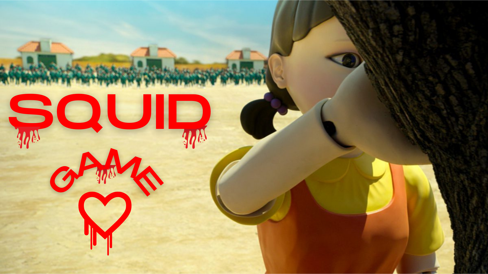

# Squid Game Red Light/Green Light (OpenCV)



## Software

##### PyCharm

## Packages 

##### 1) Mediapipe
##### 2) OpenCV
##### 3) Playsound
##### 4) Numpy
##### 5) Imutils

  
## Features

- Body Parts Tracker using Mediapipe ( Checkout the `landmarks.png` )
- All the Body Parts below Neck will be considered for this Game. Any movements after Red Light is considered DEAD!!
- Sound Functionality


## To Run The Project

```bash
  Import the Folder into Pycharm.
```
```bash
  Install all the Required Packages via the Python Interpreter Settings in PyCharm
```
```bash
  Open game.py and you may change this code:
    `def make_720p():
      cap.set(3,1280)
      cap.set(4,720)`
  According to your Laptop/PC Screen Resolution 
```
```bash
 Try running the Project. The game will start once the entire body is within the Webcam frame.
 
 Enjoy The Game and Stay Alive!! ;)
```

## Demo

Check out the Live Demo: <br>

https://www.youtube.com/channel/UCDjxbECX5VasX1JYJY6lwwg

